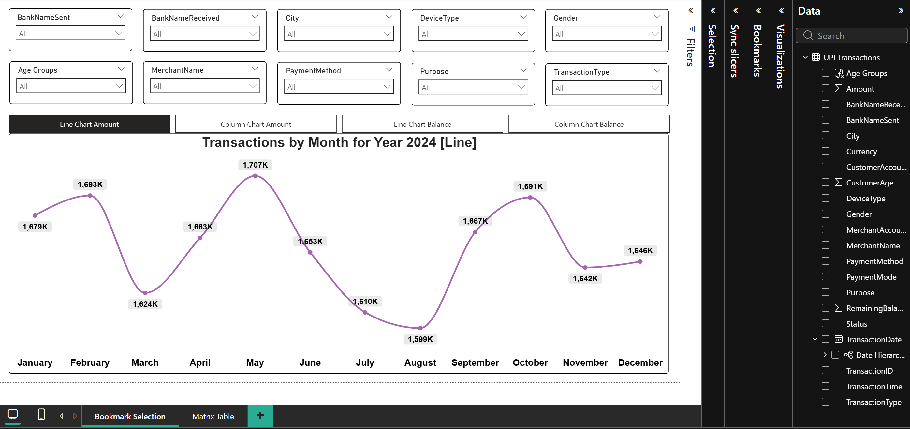
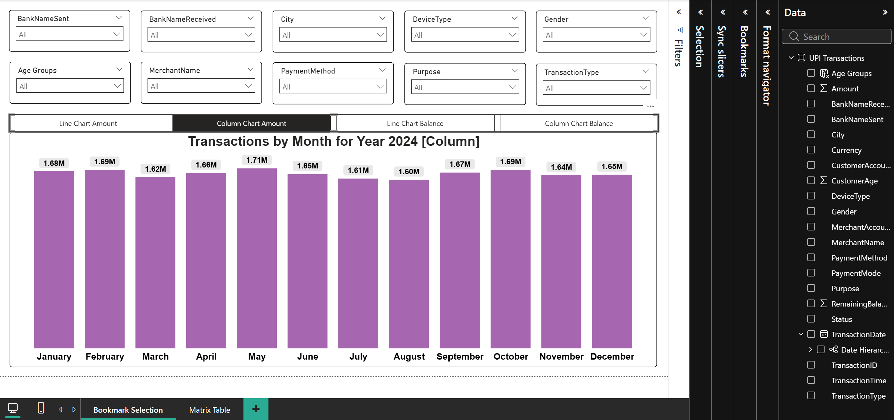

# UPI Transactions — Power BI Dashboard

Power BI report built on a UPI transactions dataset to analyze transaction volume and value, success vs failed performance, trends over time, and breakdowns by banks, merchants, cities, devices, payment methods, and customer demographics.

> Data source: `UPI_Transactions.xlsx` (Sheet1)

---

## Project goals

- Track **overall transaction performance** (total amount, number of transactions, success rate).
- Identify **time-based patterns** (daily/weekly/monthly trends, MoM change).
- Compare **success vs failed** transactions across key dimensions (bank, city, payment mode/type).
- Explore **merchant and purpose** drivers (Top N merchants, purpose distribution).
- Provide **drillthrough detail** for investigation and export.

---

## Dataset overview

| Metric | Value |
|---|---:|
| Records | 20,000 |
| Columns | 20 |
| Date range | 2024-01-01 → 2024-12-30 |
| Total Amount (sum) | 19,872,274.03 |
| Average Amount | 993.61 |
| Success Rate (Status = Success) | 80.0% |

**Cardinality highlights (approx. unique values):**  
BankNameSent=4, BankNameReceived=4, City=4, Gender=2, TransactionType=2, Status=2, DeviceType=3, PaymentMethod=3, MerchantName=5, Purpose=5, PaymentMode=2, Currency=4.

> Note: `CustomerAccountNumber` appears unique per row in this dataset, so “returning customer” style analytics (retention/cohorts) would require a separate customer dimension or a generated customer ID logic.

---

## Data dictionary (selected fields)

- **TransactionID**: Unique transaction identifier (key).
- **TransactionDate**: Transaction date (should link to a Date dimension).
- **TransactionTime**: Time (hh:mm:ss) — can be converted to Time type and used to derive Hour/Time bands.
- **Amount**: Transaction amount (numeric/decimal).
- **Currency**: Currency code (dimension/slicer).
- **Status**: Transaction status (`Success` / `Failed`).
- **TransactionType**: Type (e.g., `Transfer` / `Payment`).
- **PaymentMode**: Mode (e.g., `Instant` / `Scheduled`).
- **PaymentMethod**: Method (e.g., `QR Code`, etc.).
- **BankNameSent / BankNameReceived**: Sending/receiving bank (bank analysis).
- **City**: City dimension.
- **Gender**: Demographic dimension.
- **CustomerAge**: Customer age (used for grouping/banding).
- **DeviceType**: Device used (e.g., Mobile/Tablet/Desktop).
- **MerchantName**: Merchant dimension (Top N analyses).
- **Purpose**: Purpose/category (e.g., Food, etc.).
- **RemainingBalance**: Post-transaction balance (useful for outlier checks).
- **CustomerAccountNumber / MerchantAccountNumber**: Sensitive identifiers (recommended masking before publishing).

---

## Calculated columns - Age Groups (customer segmentation)

Name: Age Groups
Type: Calculated column (DAX)
Table: UPI Transactions
Goal: Create age bands for slicers/legends/axis grouping and demographic comparisons.

```dax
Age Groups =
IF(
    'UPI Transactions'[CustomerAge] <= 25, "A1", 
    IF('UPI Transactions'[CustomerAge] <= 35, "A2", "A3")
)
```

Logic

A1: Age ≤ 25

A2: Age 26–35

A3: Age ≥ 36

Typical usage

Slicer: filter the entire report by age segment

Legend: split bars/lines by age group

Axis: compare KPIs by age group

---

## Bookmark Selection (Page)

This page demonstrates **bookmark-based visual switching** for monthly trend analysis. Users can toggle between **Line vs Column** views, and between **Amount vs Balance** views, while keeping the same slicers/filters applied.

---

### Global slicers (page-level filters)

The top section contains slicers that filter the currently displayed chart (and remain consistent when switching bookmarks):

- **BankNameSent**
- **BankNameReceived**
- **City**
- **DeviceType**
- **Gender**
- **Age Groups**
- **MerchantName**
- **PaymentMethod**
- **Purpose**
- **TransactionType**

All slicers are set to **All** by default, enabling an immediate “full dataset” view.

---

### Bookmark navigation (visual switcher)

A horizontal navigation strip is used to switch the displayed chart via bookmarks:

- **Line Chart Amount**
- **Column Chart Amount**
- **Line Chart Balance**
- **Column Chart Balance**

Each button triggers a corresponding bookmark that changes which chart is visible, while preserving the same page layout and slicer selections.

---

### Visual: Transactions by Month for Year 2024 [Line] — Amount

**Type:** Line chart  
**Title:** `Transactions by Month for Year 2024 [Line]`  
**Purpose:** Show the monthly trend for **Amount** over the year 2024.



**Key characteristics:**
- X-axis: **Month (January → December)**
- Y-axis: **Amount (aggregated)** displayed with formatted labels (e.g., **K** units)
- Data labels enabled on each point for quick month-to-month comparison
- Smooth trend visibility with markers highlighting peaks and dips

---

### Visual: Transactions by Month for Year 2024 [Column] — Amount

**Type:** Clustered column chart  
**Title:** `Transactions by Month for Year 2024 [Column]`  
**Purpose:** Show the monthly distribution for **Amount** over the year 2024.



**Key characteristics:**
- X-axis: **Month (January → December)**
- Y-axis: **Amount (aggregated)** displayed with formatted labels (e.g., **M** units)
- Data labels enabled on each column for fast ranking/comparison
- Best for spotting the “highest/lowest months” at a glance

---

### Balance visuals (via bookmarks)

The same layout and logic are used for **Balance** analysis:

- **Line Chart Balance**: monthly trend view for **Balance** (aggregated)
- **Column Chart Balance**: monthly comparison view for **Balance** (aggregated)

These visuals are accessed through the same bookmark navigation strip and react to the same slicers.

---

### Interaction behavior

- Slicers apply to the chart currently visible.
- Switching between bookmarks changes only the visible visual (Line/Column, Amount/Balance), allowing users to compare perspectives without rebuilding the page or changing filters.
- The page is designed for quick exploratory analysis (trend vs comparison) using the same filtered context.

